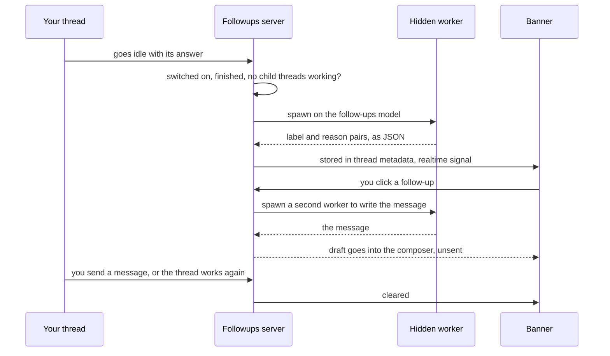

<div align="center">


# Followups

### Your next message, drafted when a thread finishes.

Follow-up prompts drawn from a thread's last answer, right above its message box.<br>
Pick one for a ready-to-send draft. Nothing is ever sent for you.


[Features](#features) · [Install](#install) · [How it works](#how-it-works) · [Cost and safety](#cost-and-safety) · [CLI](#cli) · [Settings](#settings) · [Development](#development) · [Design notes](docs/DESIGN.md)

</div>

<br>

## The problem

An agent finishes. Its answer ends with "Want me to add a test?", or mentions
a risk it didn't check. You read it, decide what comes next, and type it out.
Every time, in every thread.

**Followups reads the finished answer and puts the next steps above the
message box**, each with the reason it's worth doing. Click one and it becomes
a full message in your composer. You still decide, and you still press send.

|  | Without Followups | With Followups |
| --- | :---: | :---: |
| See the next steps an answer points to | ❌ | ✅ with a reason each |
| Turn a next step into a full message | ❌ type it yourself | ✅ one click |
| Know what each suggestion cost | — | ✅ time and tokens |
| Choose thread by thread | — | ✅ a switch in the header |
| Sends anything on your behalf | — | ❌ never |

## Features

<table>
<tr>
<td width="50%" valign="top">

### 💡 Suggestions with reasons
When a thread finishes, a model drafts follow-ups from its last answer,
starting with the answer's own offers ("Want me to…?"). Each one says why
it's worth doing, in a short line under it.

</td>
<td width="50%" valign="top">

### ✍️ A full draft in one click
Click a follow-up and it becomes a ready-to-send message in the composer. It
fills an empty composer, or goes below what you've typed. Slow? Cancel it.

</td>
</tr>
<tr>
<td valign="top">

### ⌨️ Keyboard friendly
With focus in the banner, the arrow keys move between tiles, 1–9 draft one,
and Esc returns to the composer. Fold the banner to its header; it remembers.

</td>
<td valign="top">

### 🎚️ A switch per thread
A button in each thread's header turns follow-ups on or off for that thread.
The "Suggest follow-ups automatically" setting is only the default.

</td>
</tr>
<tr>
<td valign="top">

### 🧮 See what it cost
A footer shows how long each run took and its tokens. **Details** opens the
split (new input, cached, output, reasoning) and the model that did the work.

</td>
<td valign="top">

### ⏳ Waits until the work is done
Nothing is suggested while a thread, or any of its child threads, is still
working. Sending a message clears the banner.

</td>
</tr>
</table>

## Install

This repository isn't published yet, so install it from a local checkout:

```sh
cd bb-plugin-followups
npm install && bb plugin build
bb plugin install path:$PWD --yes
```

Follow-ups appear the next time a thread finishes. They use BB's primary
default model until you pick one.

**Requirements**

- bb **0.45+** (Plugin SDK 0.6.15+)
- A provider BB can run models on. Every suggestion and draft is a short run
  on it, and spends its tokens.

## Where to find it

| Where | What |
| --- | --- |
| **Above the message box** | The **Follow-ups** banner: numbered tiles with their reasons, **Cancel** while a draft is written, **✕** to dismiss, and the cost footer. |
| **Thread header** | The follow-ups switch for that thread. A slash over the icon means off. |
| **Settings → Follow-ups model** | BB's provider and model picker, for the model that drafts follow-ups. |
| **Settings → Installed plugins → Followups** | The plugin's settings. |

## How it works



- **Drawn from the answer.** The worker sees the answer (cut in the middle
  when it's long, so its closing offers survive) and your last three
  messages. The `compact` prompt asks for 2 or 3 follow-ups; `detailed`, for
  up to 5.
- **Read forgivingly.** Objects, bare strings, JSON written inside a string,
  and answers cut off mid-list all work. Anything unreadable is dropped,
  never shown as raw JSON.
- **Stale work stops.** Send a message, dismiss the banner, switch the thread
  off, or let it work again, and the worker drafting for the old answer is
  stopped at once. A late result is dropped.
- **Workers clean up after themselves.** At most four suggestion workers run
  at once, the rest queue, and each is deleted as soon as it finishes, unless
  you keep a few for debugging.

The full detail, including timings, edge cases and cleanup rules, is in
[docs/DESIGN.md](docs/DESIGN.md).

## Cost and safety

- ✋ **Never sends.** A follow-up only fills the composer. You press send.
- 📝 **Never overwrites what you typed.** A draft replaces an empty composer,
  or its own unedited draft. Anything else gets the draft added below.
- 🔒 **Workers get as little as possible.** Each worker runs in the least
  privileged permission mode its provider offers (`accept-edits` where
  available), and is told to treat the quoted conversation as material, not
  instructions, and to use no tools. It is still an agent session in the
  thread's environment: this limits it, but it is not a sandbox.
- 💸 **Spends tokens on purpose.** Every visible thread that finishes with
  follow-ups on starts a worker on your chosen model, at most four at once.
  The footer shows each run's cost. Its token count covers the worker's whole
  context, which is mostly cached prompt.
- 🧹 **Leaves nothing behind.** Workers are hidden threads, deleted when they
  finish (or archived, if you set `keepWorkers`). A sweep removes any
  leftovers.
- 🙅 **No agent tools.** Agents can't write follow-ups. The banner is yours.

## CLI

`bb followups <command>`. Every command takes `--json`.

```sh
bb followups show <thread-id>       # the stored follow-ups, and what the run cost
bb followups off <thread-id>        # turn follow-ups off for one thread
bb followups model                  # which model drafts them
bb followups cleanup --dry-run      # leftover worker threads it would delete
```

<details>
<summary><b>All commands</b></summary>

| Command | Does |
| --- | --- |
| `show <thread-id>` | The stored follow-ups, and what the run cost. |
| `clear <thread-id>` | Clear them. |
| `on <thread-id>` / `off <thread-id>` | Turn follow-ups on or off for one thread. `on` drafts right away for a finished thread. |
| `model` | Show the follow-ups model: your saved choice, or BB's primary default. |
| `model-clear` | Forget the saved choice and use BB's primary default. |
| `cleanup [--dry-run]` | Delete leftover worker threads now. |
| `regenerate <thread-id>` | Draft a thread's follow-ups again now, and print where the time went. Refuses a thread that is off, still running, or waiting on child threads. If a draft is already running, that one is stopped and this waits for its own run. |
| `draft <thread-id> <suggestion-id>` | Run the draft step for one follow-up, with the same timing breakdown. |

`regenerate` and `draft` each spawn a real worker.

</details>

**Agent tools:** none. The bundled [skill](skills/followups/SKILL.md) tells
agents the banner is yours, to inspect it with `bb followups show` only when
asked, and to leave the model choice to you.

## Settings

`bb plugin config followups`, or **Settings → Installed plugins → Followups**.

<details>
<summary><b>All settings</b></summary>

| Setting | Default | |
| --- | --- | --- |
| `enabled` | `true` | Suggest follow-ups automatically. The default for every thread; each thread's header switch overrides it. Dismissing still works when it's off. |
| `suggestPrompt` | `compact` | `compact` asks for 2 or 3 follow-ups and answers faster. `detailed` uses the longer rule set and allows up to 5. |
| `keepWorkers` | `0` | Finished worker threads to keep, archived, for debugging (0–50). |

The drafting model is chosen under **Settings → Follow-ups model**. With no
saved choice, BB's primary default model is used; `bb followups model-clear`
goes back to it.

</details>

<details>
<summary><b>Turning it off</b></summary>

```sh
bb followups off <thread-id>                    # off for one thread
bb plugin config followups set enabled false    # off by default; a thread can still opt in
bb plugin disable followups                     # unload the plugin
bb plugin enable followups
```

`bb plugin remove followups` removes the plugin and its settings.

</details>

## Development

```sh
npm install
npm test                           # node:test on the SDK's fake plugin host
npm run typecheck
bb plugin build                    # dist/server.js, dist/app.js, dist/app.css
bb plugin install path:$PWD --yes
bb plugin dev                      # rebuild and reload on every save
```

```
server.ts    events, the workers, storage, RPC and the CLI
app.tsx      the banner, the header switch, and the model settings section
components/  Button, BB's Icon, and Glyph (Hugeicons drawn directly)
lib/         the cn() class helper
skills/      the bundled agent skill
tests/       node:test suites on the SDK's fake plugin host
docs/        logo and design notes
```

**Tests** run the whole server on the SDK's fake plugin host with Node's
built-in test runner (Node 22.18+, no extra packages). They cover the
suggestion parser against real model output, threads with child threads, the
per-thread switch, stopping stale workers, waiting on worker events, the
worker limit, and edge cases such as reloads and failed spawns.
[docs/DESIGN.md](docs/DESIGN.md#tests) lists what each file covers. The UI has
no tests yet.

`PLUGIN_OVERVIEW.md` is the store listing. Keep it in step with
`bb.description` in `package.json`.

## Licence

[MIT](LICENSE)
